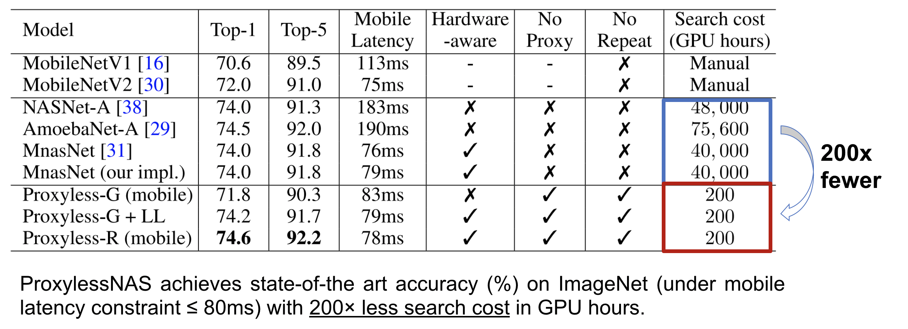
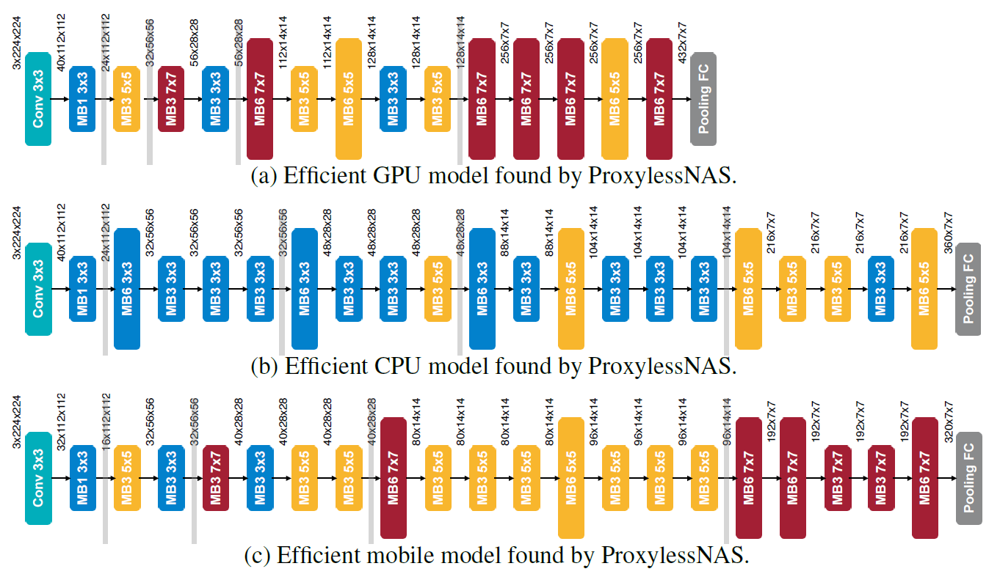

  
# ProxylessNAS: Direct Neural Architecture Search on Target Task and Hardware [[arXiv]](https://arxiv.org/abs/1812.00332) [[Poster]](assets/ProxylessNAS_iclr_poster_final.pdf)
```bash
@inproceedings{
  cai2018proxylessnas,
  title={Proxyless{NAS}: Direct Neural Architecture Search on Target Task and Hardware},
  author={Han Cai and Ligeng Zhu and Song Han},
  booktitle={International Conference on Learning Representations},
  year={2019},
  url={https://arxiv.org/pdf/1812.00332.pdf},
}
```

## News
- ProxylessNAS is integrated into [PytorchHub](https://pytorch.org/hub/pytorch_vision_proxylessnas/).
- ProxylessNAS is integrated into Microsoft [NNI](https://nni.readthedocs.io/en/v1.6/NAS/Proxylessnas.html).
- ProxylessNAS is integrated into Amazon [AutoGluon](https://auto.gluon.ai/0.3.0/tutorials/nas/enas_proxylessnas.html).
- First place in the Visual Wake Words Challenge, TF-lite track, @CVPR 2019
- Third place in the Low Power Image Recognition Challenge (LPIRC), classification track, @CVPR 2019

## Performance
Without any proxy, directly and efficiently search neural network architectures on your target **task** and **hardware**! 

Now, proxylessnas is on [PyTorch Hub](https://pytorch.org/hub/pytorch_vision_proxylessnas/). You can load it with only two lines!

```python
target_platform = "proxyless_cpu" # proxyless_gpu, proxyless_mobile, proxyless_mobile14 are also avaliable.
model = torch.hub.load('mit-han-lab/ProxylessNAS', target_platform, pretrained=True)
```


<p align="center">
    
</p>



<table>
<tr>
    <th> Mobile settings </th><th> GPU settings </th>
</tr>
<tr>
    <td>
    
    </td>
<td>

| Model                | Top-1    | Top-5    | Latency | 
|----------------------|----------|----------|---------| 
| MobilenetV2          | 72.0     | 91.0     | 6.1ms   |
| ShufflenetV2(1.5)    | 72.6     | -        | 7.3ms   |
| ResNet-34            | 73.3     | 91.4     | 8.0ms   |
| MNasNet(our impl)    | 74.0     | 91.8     | 6.1ms   | 
| ProxylessNAS (GPU)   | 75.1     | 92.5     | 5.1ms   |

</td>
</tr>
<tr>
    <th> ProxylessNAS(Mobile) consistently outperforms MobileNetV2 under various latency settings.  </th>
    <th> ProxylessNAS(GPU) is 3.1% better than MobilenetV2 with 20% faster. </th>
</tr> 

</td></tr> </table>

## Specialization

People used to deploy one model to all platforms, but this is not good. To fully exploit the efficiency, we should specialize architectures for each platform.




We provide a [visualization](assets/visualization.mp4) of search process. Please refer to our [paper](https://arxiv.org/abs/1812.00332) for more results.
 
# How to use / evaluate 
* Use
    ```python
    # pytorch 
    from proxyless_nas import proxyless_cpu, proxyless_gpu, proxyless_mobile, proxyless_mobile_14, proxyless_cifar
    net = proxyless_cpu(pretrained=True) # Yes, we provide pre-trained models!
    ```
    ```python
    # tensorflow
    from proxyless_nas_tensorflow import proxyless_cpu, proxyless_gpu, proxyless_mobile, proxyless_mobile_14
    tf_net = proxyless_cpu(pretrained=True)
    ```

    If the above scripts failed to download, you download it manually from [Google Drive](https://drive.google.com/drive/folders/1qIaDsT95dKgrgaJk-KOMu6v9NLROv2tz?usp=sharing) and put them under  `$HOME/.torch/proxyless_nas/`.

* Evaluate

    `python eval.py --path 'Your path to imagent' --arch proxyless_cpu  # pytorch ImageNet`
    
    `python eval.py -d cifar10 # pytorch cifar10 `
    
    `python eval_tf.py --path 'Your path to imagent' --arch proxyless_cpu  # tensorflow`


## File structure

* [search](./search): code for neural architecture search.
* [training](./training): code for training searched models.
* [proxyless_nas_tensorflow](./proxyless_nas_tensorflow): pretrained models for tensorflow.
* [proxyless_nas](./proxyless_nas): pretrained models for PyTorch.

## Projects with ProxylessNAS:
* [ProxylessGaze](./proxyless_gaze/): Real-time Gaze Estimation with ProxylessNAS
<div align=center>
</img>
</div>

## Related work on automated model compression and acceleration:

[Once for All: Train One Network and Specialize it for Efficient Deployment](https://arxiv.org/abs/1908.09791) (ICLR'20, [code](https://github.com/mit-han-lab/once-for-all))

[ProxylessNAS: Direct Neural Architecture Search on Target Task and Hardware](https://arxiv.org/pdf/1812.00332.pdf) (ICLR’19)

[AMC: AutoML for Model Compression and Acceleration on Mobile Devices](https://arxiv.org/pdf/1802.03494.pdf) (ECCV’18)

[HAQ: Hardware-Aware Automated Quantization](https://arxiv.org/pdf/1811.08886.pdf)  (CVPR’19, oral)
	
[Defenstive Quantization: When Efficiency Meets Robustness](https://openreview.net/pdf?id=ryetZ20ctX) (ICLR'19)
